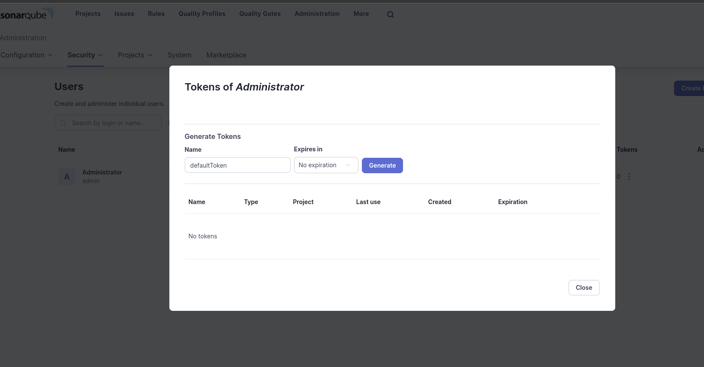

# SonarQune

## Install by Helm

```bash
helm repo add sonarqube https://SonarSource.github.io/helm-chart-sonarqube
helm repo update
helm upgrade --install -n sonarqube sonarqube sonarqube/sonarqube

kubectl -n sonarqube logs sonarqube-sonarqube-0
kubectl -n sonarqube logs sonarqube-postgresql-0

kubectl -n sonarqube port-forward svc/sonarqube-sonarqube 9000:9000
```

# Sonnar Scanner



```bash
docker run --rm \
    --network=host \
    -e SONAR_HOST_URL="http://192.168.49.2:30009" \
    -e SONAR_LOGIN="squ_67db876dcbbee846d88b147beb2b35a453e33c4e" \
    -v $(pwd)/sonar-scanner:/usr/src/ \
    sonarsource/sonar-scanner-cli
```